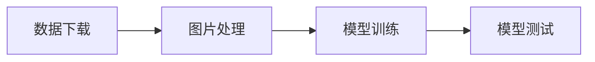
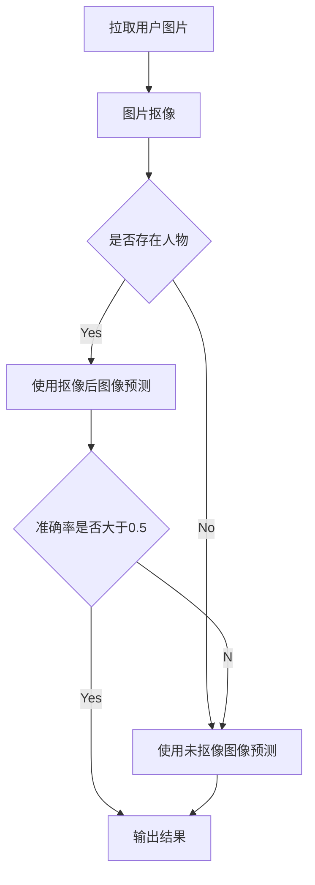

# 测测你像哪位动漫角色？基于YOLOv8的人脸识别游戏

本项目旨在创建一个趣味性的人脸识别游戏。核心使用YOLOv8目标检测算法来识别网络上收集的动漫人物图片。最终实现是一个可交互的GUI，用户可以上传任意图片，将给出认为图片中是哪一位动漫人物的结果和相应概率。

# 游戏效果

运行`run.py`后弹出游戏界面，提示上传图片


上传一张动漫图，开始预测


可以看到，给出认为图片中是哪一位动漫人物的结果和相应概率。

# 项目实现

此项目大致可分为如下四步：



项目文件说明：

- `requirements.txt`指明了本项目所需的所有库；

- `SplitPic.py`完成数据的划分操作，划分出测试集、测试集和验证集；

- `Train.py`完成模型训练操作，具体使用YOLOv8模型；

- `best.pt`是训练完成模型的权重文件；

- `run.py`对原始图片进行抠图，进行预测，并实现了可以交互的GUI，用户可以通过此参与游戏--测测你像哪位动漫角色？

## 数据集

本项目使用的数据来源于[iCartoonFace](https://github.com/luxiangju-PersonAI/iCartoonFace)数据集，是目前图像识别领域规模最大、质量最高、注释丰富、跨越多个事件的数据集之一，包括近似重复、遮挡和外观变化，由 5,013 个卡通人物的 389,678 张图像组成，并标注了身份、边界框、姿势和其他辅助属性。本项目具体使用其中的[iCartoonFace识别训练和测试数据集](https://drive.google.com/drive/folders/1m6pAL9Wbn8B1td0hFUj9RVRrSweNKskW?usp=sharing)进行训练和测试，标签信息来源于[iCartoonFace识别人物信息](https://drive.google.com/file/d/1rOmoseZXAKG5y7mkEsVAoaWan2dIrMzD/view?usp=sharing)，它由文件名`x1`，`y1`，`x2`，`y2`，`label_id`组成。如果标签id等于-1，则表示该图像标签不属于当前的任何类别。

数据集存储的格式如下：
```
icartoonface_rectrain
│     
└───personai_icartoonface_rectrain_00006
│   │   personai_icartoonface_rectrain_00006_0000000.jpg
│   │   personai_icartoonface_rectrain_00006_0000001.jpg
│   │   ...
│  
└───personai_icartoonface_rectrain_00007
    │   personai_icartoonface_rectrain_00007_0000000.jpg
    │   personai_icartoonface_rectrain_00007_0000001.jpg
    │   ...
```

标签文件`icartoonface_rectest_idInfo.txt`格式如下：
```
{'id': 'personai_icartoonface_rectrain_00006', 'name': '松坂梅', 'url': 'http://baike.baidu.com/view/102893.htm'}
{'id': 'personai_icartoonface_rectrain_00007', 'name': '石井健太郎', 'url': 'http://baike.baidu.com/view/1405523.htm'}
{'id': 'personai_icartoonface_rectrain_00008', 'name': '李莓铃', 'url': 'http://baike.baidu.com/view/1934856.htm'}
{'id': 'personai_icartoonface_rectrain_00009', 'name': '假面骑士王蛇', 'url': 'http://baike.baidu.com/view/2632485.htm'}
...
```


## 图片处理

下载所需库

```python
pip install -r requirements.txt
```

运行`SplitPic.py`进行数据集的划分。

 ## 模型训练

运行`Train.py`，的训练参数如下

```python
from ultralytics import YOLO

model = YOLO("yolo-cls/yolov8x-cls.pt")
if __name__ == '__main__':
    model.train(data='dataset', epochs=100, batch=-1, imgsz=150)
```

## 项目的运行流程



## 模型测试

训练完成的模型的权重文件为`best.pt`，通过 `run.py` 进行模型的测试。

`run.py`先进行图像的抠图，抠图完成的图像将生成为同一目录的`img_cold.jpg`文件，然后进行模型的预测。

```python
model = YOLO('best.pt')
```

之后就可以在GUI上玩游戏啦！

# 写在最后

Have a good time!